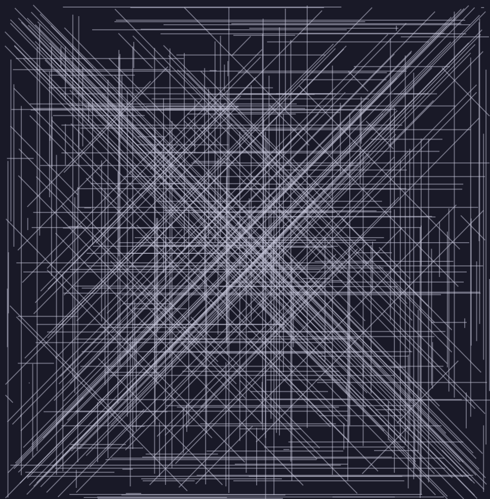

# AdventOfCode2021
Advent of Code 2021 https://adventofcode.com/2021

## Day 1: Sonar Sweep
Just zipwith the list of numbers with itself using (>) to get a list of bools. Transpose and sum on part 2 to add the lists. There is probably a nicer way of doing part 2 using Control.Applicative to add the lists, I'll figure that out later. Most of these I do a quick answer then go and find nicer ways to do it much later on.

## Day 2: Dive!
Was warming up my integer trig package when I read "aim" in part 2, but was a simple addition to part 1 in the end. Bodged the read function, which is ugly, but a lot faster to type than doing the proper invertible syntax descriptions one

## Day 3: Binary Diagnostic
This was a step up in difficulty from day 2. I found it quite hard in Haskell. For Haskell I need to have the whole picture in my head to put out a good solution and there was a lot going on in the puzzle compared to 1 and 2. Part 2 didn't feel like something I could work through iteratively (not whilst trying to be quick, anyway!)

## Day 4: Giant Squid
For real, the thing that took the longest here was that I forgot haskell can't tell the difference between -1 and - 1. Confusing early in the day! I guessed that part 2 would punish hackery on part 1 so I took a bit longer and, hurrah, got part 2 for free.

## Day 5: Hydrothermal Venture
Big hint in part 1 that part 2 was going to add diagonal lines. Would have been interesting to see arbitrary lines but I suspect there is more than one valid way to draw such a line, also it would have been really hard to resist anti-aliasing them all. 
<p align="center">
  
</p>

## Day 6: Lanternfish
When it says exponentially in bold, don't brute force it! Glad it was a short one for Monday morning.

## Day 7: The Treachery of Whales
That was the shortest one yet. I fear for what's coming :)

## Day 8: Seven Segment Search
Part 1 was quick. Took a long time for part 2. I think, you could just brute force it and find the combinations that make sense, which sounds quicker to write. I might have a go later. I'm happy with my part 2, it was just slow to build.

## Day 9: Smoke Basin
There are better ways to do this using monads to pass the state around, but at 7am I'm just going to move it all around manually.
Edit : Ok, I rewrote part 2 in the state monad. Wasn't too hard (and it's still a bit of a mess) but required more thinking than the original. I will need to write a lot of these before I can use them as quickly as bodging it with C-like Haskell :)

## Day 10: Syntax Scoring
Not too difficult today, push opens onto a stack and then check its reverse is the next closing character. Part 2 was easy which usually means there is a quick hack for part 1 that I didn't use :) . 25 years of trying to pass code reviews has made it quite hard to find the hacky solution, I usually have a mental eye out for test cases and what comes next.

## Day 11: Dumbo Octopus 
Quite straightforward, wasted quite a lot of time on a ridiculous bug. Again, I threaded data through a complicated structure by hand rather than keeping it in a monad which I think is the solution I would try with more time. Clearly the thing to practice for next year is passing state around quickly the right way.

## Day 12: Passage Pathing
Took quite a while to do this one, got lost in part 1 tracking which nodes had been visited and initially only let a node be visited once in *any* walk but obviously it's only once per individual walk. Second part was quite straightforward after that although I stopped to tidy up the mess before doing it. For part 2 I generated all possible graphs where a single lower case node can be visited twice, walked them all and merged the result. Slow, but very easy to think about when you're trying to hurry up.

## Day 13: Transparent Origami
I really like the ones where you draw out a code in big letters.
```
###   ##  #### ###   ##  ####  ##  ###
#  # #  #    # #  # #  # #    #  # #  #
###  #      #  #  # #    ###  #  # ###
#  # #     #   ###  #    #    #### #  #
#  # #  # #    # #  #  # #    #  # #  #
###   ##  #### #  #  ##  #### #  # ###
```

## Day 14: Extended Polymerization
You knew part 2 was going to be part 1 but too hard to do the simple way. I still did part 1 the simple way as it was easy and just in case part 2 wasn't what I was expecting. It feels a bit "stream of consciousness" when I look back at the code but other than cleaning up unused wrapper functions I'm not going back and tidying up any of these.

## Day 15: Chiton
So this felt a bit too cheaty. It's a maze problem and Haskell has astar and dijkstra in the Algorithm.Search module, so that takes care of that. Getting the cost data in would have been tricky so I just copied the input in as a constant string inside the cost function. I guessed part2 would be either a tiling of the map or a new set of directions so I made sure the map was tiled just in case, paid off. All I really had to do for part 2 was change the number of tiles and implement the wrap back to 1 function. Bit messy, bit cheaty, but part 2 took about 10 seconds. Might come back to this one and implement something a bit cleaner.
